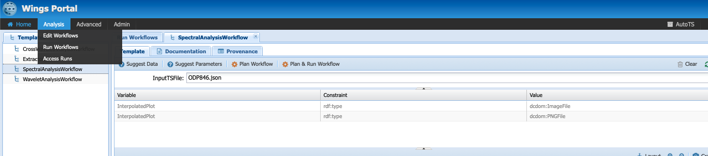

# Tutorial

This tutorial provides a walkthrough of the unique capabilities of autoTS. autoTS is based on the [WINGS](https://www.wings-workflows.org) workflow system, which uses semantic constraints to reason about workflows and as a result it can assist a user to create valid workflow.

To learn the basics about running workflows in WINGS, follow [this tutorial](https://www.wings-workflows.org/tutorial/tutorial.html).

## Table of content
* [Running a workflow](#run)
* [Accessing your results](#results)
* [Uploading data](#data)

## <a name='run'> Running a workflow in autoTS</a>

autoTS comes with several abstract templates for the analysis of time series data. These templates represent strategies used by researchers to analyze their data that can be instantiated with various methods. An example of a workflow strategy for spectral analysis is presented below:

The methods are available through the [Pyleoclim](https://pyleoclim-util.readthedocs.io/en/stable/) Python package.

* To access a workflow templates, select `Analysis` -> `Run Workflows` in the WINGS portal:

* Double-click on an abstract template:

* The template represents the strategy for spectral analysis. Each of the grey box represent a type of function that can be performed (i.e., detrend). The blue boxes represent data flow in between the functions and the green boxes, the parameters.

* You can run workflows by specifying an input timeseries, then click on `Plan Workflow`. The following window will appear:

* Under templates, you can select the executable workflow that you wish to run, which has been instanciated with proper methods. WINGS can reason over constraints. In our example, one such constraints is that the Lomb-Scargle method doesn't require evenly-spaced data, therefore the LinearInterpolation is greyed out. You can run the workflow by clicking `Run Selected Workflow`.

* You can run all possible workflows by selecting `Plan and Run Workflow`.

## <a name='results'> Accessing your results</a>

* Go to `Analysis` -> `Access Runs`

* On the top pane, you can see the progress of your analysis. The bottom pane will contain your results:

  - The `data` tab contains the results of all your intermediate and final outputs along with the input data and parameter values. autoTS returns a plot of the results at each step, allowing you to dig through the results of the analysis. The JSON outputs are a serialization of the [Pyleoclim objects](https://pyleoclim-util.readthedocs.io/en/stable/core/ui.html). Pyleoclim contains several [methods](https://pyleoclim-util.readthedocs.io/en/stable/utils/introduction.html#jsonutils) to import/export objects in/to JSON.

  - The `run log` tag contains a log of the executions of each method. Note that already executed components will not be rerun twice for efficiency.

  - The `template` tab contains the strategy while the `executable worklfow` tab shows you the workflow that has been executed along with a unique identifier for the data.

## <a name='data'> Uploading data</a>

* Click on `Advanced` -> `Manage Data`

* Expand the data folder until you have access to `TimeSeriesJSON`.

A `TimeSeriesJSON` data type is essentially a `Series` object in Pyleoclim. You can create a JSON file from a `Series` object using the [utilities](https://pyleoclim-util.readthedocs.io/en/stable/utils/introduction.html#jsonutils) in Pyleoclim.

* To add a new Series, make sure that `TimeSeriesJSON` is selected and click on upload file.

A dialogue box will appear. Click `Add File` and select the file on your local machine. Then click `Upload`. Your timeseries is ready to use!
